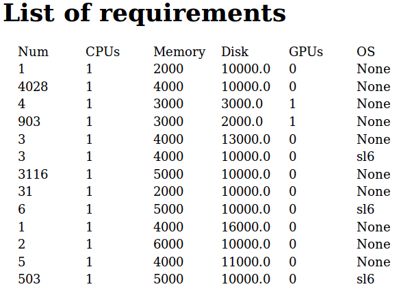

pyglidein
=========

A python server-client pair for submitting HTCondor glidein jobs on
remote batch systems.

Overview
--------

As pictured above, pyglidein is used to run glideins on remote sites,
adjusting for pool demand automatically. It consists of a server
running on the central HTCondor submit machine and a number of clients
on remote submit machines. The client will submit glideins which
connect back to the central HTCondor machine and advertise slots
for jobs to run in. Jobs then run as normal.

Server
------

The server has two components, one to check on queue status and one
to present the status to clients.

### Queue Status

`condor_q` is used to retrieve the queue status (idle jobs). Attributes
recorded are:

* RequestCPUs
* RequestMemory
* RequestDisk
* RequestGPUs
* OpSysAndVer

This is on a timer to refresh once every 5 minutes.

### Web Server

A web server is used to display the queue status to the world. Clients
use jsonrpc over http to get the entire queue status.

A standard http view is also available for human monitoring:

Client
------

The client is broken up into two parts: `client.py` and `submit.py`.

### client.py

The main script for the client handles interaction with the server and
decides which idle jobs could be matched by the remote site. It then
attempts to submit up to a rate limit and max jobs (idle/running) limit.

### submit.py

The submit script contains the logic for submitting a single job to the
local job scheduler, which can be HTCondor, PBS, SLURM, or others.

The config file supports limited customization of the generated submit files
to handle variations between sites running the same submit system.

Glidein
-------

The glidein wrapper contains the more easily modifiable condor variables
for fast testing/tuning. It will download the glidein tarball if necessary,
untar it, and start a condor startd with an appropriate environment.

The startd is configured for dynamic, partitionable slots, allowing it to
be repartitioned while running if job requirements change over the lifetime
of the glidein.

After a set amount of time (default 14 hours), the glidein will signal
the startd to begin graceful shutdown. The grace limit (default 20 minutes)
gives jobs a short time to complete and won't start any new jobs. Idle
glideins have an activity timeout (default 10 minutes) after which they die.
